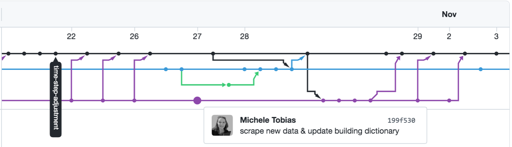

Schedule
========

| Section | Time |
| ------- | ---- |
| Introduction to version control | 3:00 - 3:15 pm |
| Using Git | 3:15 - 4:00 pm |
| Break | 4:00 - 4:10 pm |
| Branching and merging | 4:10 - 4:45 pm |
| Q&A/misc. | 4:45 - 5:00 pm |

Git Setup
=========

If you're using Git for the first time, you'll need to set a username and email. You'll do this
on the command line. To check whether a username and email have already been set, enter

```
$ git config --global user.name
```

for your username, and 

```
$ git config --global user.email
```

for your email.

If these commands return information, you're good to go. If they don't, you can use

```
$ git config --global user.name "YOUR NAME"
```

to set your username, and

```
$ git config --global user.email "YOUR EMAIL"
```

to set your email.

---

Merge Network Example
=====================

Here's an example of what it looks like to have multiple people working on separate branches in a
project directory. Each line is a separate branch and each circle is a commit. Arrows denote merges.



GitHub repository for this project: [the UC Davis DataLab's Covid Worksite Exposure Map].

[the UC Davis DataLab's Covid Worksite Exposure Map]: https://github.com/datalab-dev/covid_worksite_exposure
