# Installing Git 

In order to run Git version control and be ready for the interactive session of
this workshop, **you need to install it on your local machine.** This is
required preparation and we will not have time during the interactive session
to help you troubleshoot installation issues. If you don’t have Git installed,
you won’t be able to follow along with the activities. Git installation is
typically an easy, point and click process, but there are some configuration
steps along the way to which you’ll need to pay attention and thus we recommend
that you try this well in advance of the workshop so you have time to
troubleshoot your install if necessary.

## Git on Windows

Follow these step-by-step instructions if you're installing Git on a Windows
machine:

First, launch a web browser, the image below shows the Microsoft Edge browser:

 

Next, navigate to the following Git download URL in your browser [https://git-scm/com/downloads](https://git-scm.com/downloads):

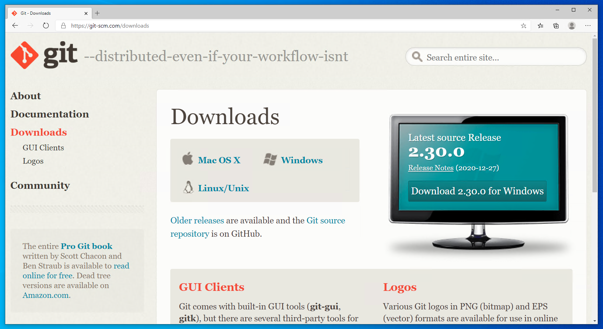 

Select "Windows" from the Downloads portion of the Git web page. Git will
display the following page and automatically being downloading the correct
version of the Git software. If the download doesn't start automatically, click
on the "Click here to download manually link":

 

When the download is complete, open/Run the downloaded file (will look
different in different browsers, but everyone shoudl know how to do this):

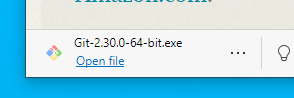 

A screen will appear asking for permissions for the Git application to make
changes to your device. Click on the **Yes** button:

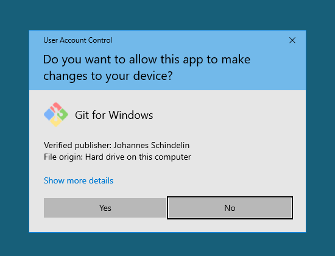 

Click **Next** to accept the user license:

 

Leave the default "Destination Location" unchanged (usually C:\Program
Files\Git) and hit **Next**

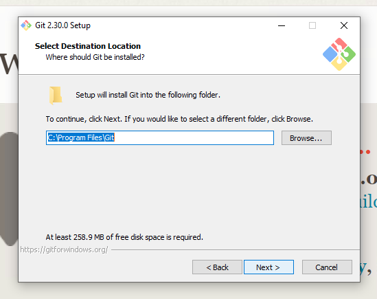

You will see a screen like the one below asking you to "Select Components":

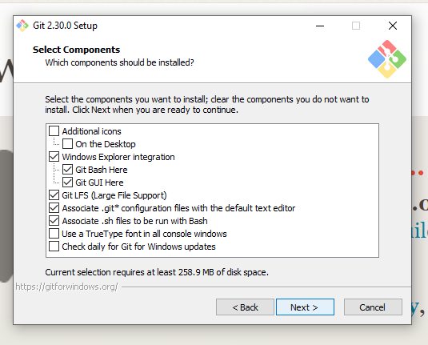

Leave all of the default components selected and also check the boxes next to
"Additional Icons" and its sub-item, "On the Desktop". Your completed
configurations window should have the following components selected:

	Additional Icons 
		-> On the Desktop
	Windows Explorer integration
		-> Git Bash Here
		-> Git GUI Here
	Git LFS (Large File Support)
	Associate .git* configuration files with default text editor
	Associate .sh files to be run with Bash
	
And should look like this:

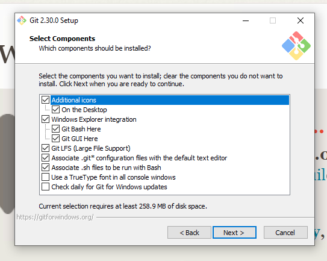

After verifying that you have the necessary components selected as per above,
hit **Next**.

The next screen will ask you to "Select a Start Menu Folder." Keep the default
value of Git and hit **Next**:

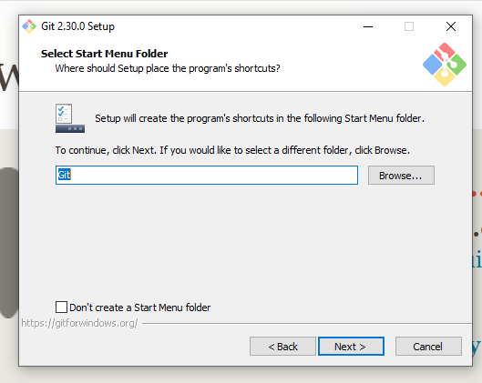

Leave the default "Use Vim (the ubiquitous text editor) as Git's default
editor" selected on the "Choosing the default editor used by Git" screen and
hit **Next**:

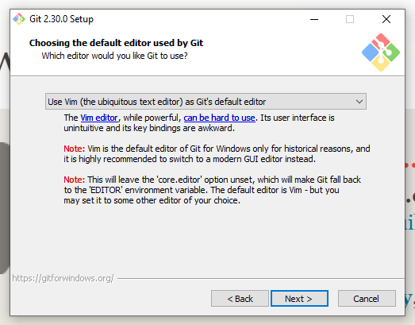

On the next screen, leave the default "let Git decide" option selected and hit
**Next**:


Leave the default "Git from the command line and also from 3rd-party software"
selected and hit **Next**:


On the next "Choosing HTTPS transport backend" page leave the default "Use the
OpenSSL library" option selected and hit **Next**:

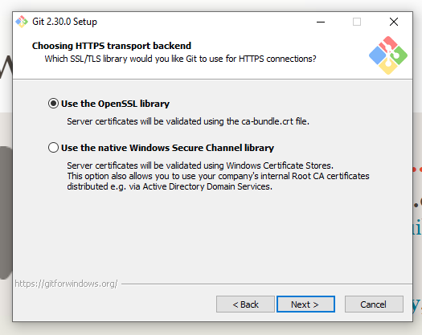

Leave the default "Checkout Windows-style, commit Unix-style line endings"
selected on the next page and hit **Next**:

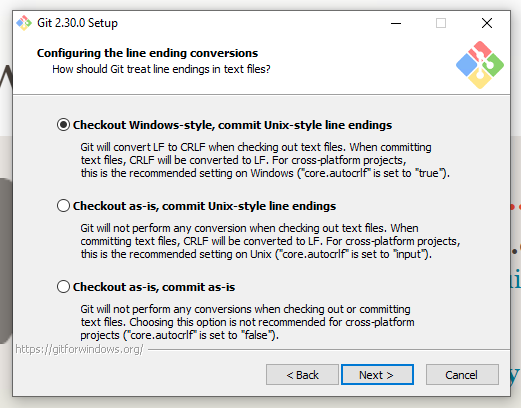

Keep the default "Use MinTTY (the default terminal of MSYS2)" selected on the
"Configuring the terminal emulator to use with Git Bash" window and hit
**Next**:


Keep the default value of "Default (fast-forward or merge)" on the "Choose the
default behavior of 'git pull'" page and hit **Next**:

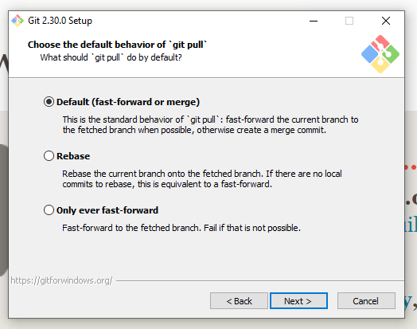

Keep the default value of "Git Credential Manager Core" on the "Choose a
credential helper" page and hit **Next**:

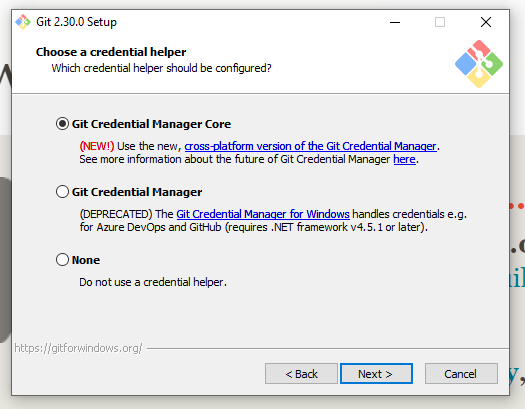

Keep the default values on the "Configuration extra options" page by keeping
"Enable file system caching" checked and "Enable symbolic links" unchecked and
then hit **Next**:

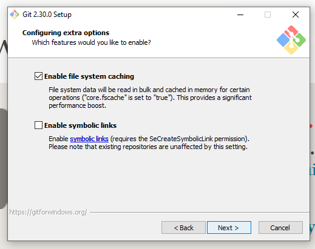

Make sure that no options are checked in the "Configuring experimental options"
page and hit **Install**:

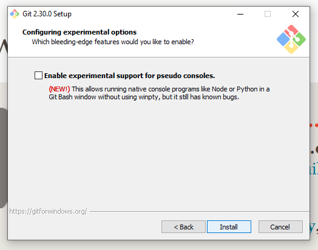

After you hit this **Install** button as per above, you will see an install
progress screen like the one below:

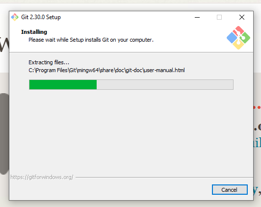

When the install is complete, a new, "Completing the Git Setup Wizard" window
like the one below will appear:


Make sure that all of the options on this window are unchecked as in the image
below and then hit the **Finish** button:


This will complete your installation process.

*Windows users should verify that downloading Git has also installed Git Bash,
which is necessary for working with Git on the command line*.

## Git on Mac

If you are installing Git on a Mac, there is no extra configuration. First, go
to the Git download page at
[https://git-scm.com/download/mac](https://git-scm.com/download/mac).  Once
you're there, you have two options for getting the software on your machine.

1. Install through Xcode (will take a while, but this also installs a whole
   suite of software development tools, which may be useful to you later on)
2. Install the binary package

The first option will take you to Apple's download page for Xcode. The second
will take you to SourceForge. Click "Download" and then run the installer
package once it's finished downloading. If you get an "unknown developer"
warning during the install process, follow the instructions at the beginning of
the video at
[https://www.youtube.com/watch?v=\_\_kr-Ew5kbE](https://www.youtube.com/watch?v=\_\_kr-Ew5kbE)
to help you work through this problem.

## Verifying Your Install

Whether you're installing Git on a Windows or a Mac, you'll find that, unlike
other applications, Git does not appear in your programs or applications
directory. While there are other applications that you can download to
interface with Git, Git is at heart a program that runs via the **command line
interface**.

### Git on the Command Line

**Mac users** will access Git through an application called "Terminal," which
ships by default with the Mac operating system. To launch the Terminal
application, go to:

> Applications -> Utilities -> Terminal

When you launch the application, you will see something like this:


Windows users will use an application called Git Bash, which was installed on 
your system when you installed Git. To launch Git Bash, go to:

> Click on the Windows Start Menu and search for "Git Bash"

Alternatively,

> Click on the Windows Start Menu, select Programs, and browse to Git Bash

When you launch the application, you will see something like this:


### Checking the Git Version

To verify that your install has worked, check the version of Git via the
command line. Regardless of whether you do this in Terminal or Git Bash, the
command will look the same:

```
$ git --version
git version 2.3....
```

After pressing enter, you should see a response that delivers information about
which version of Git is installed. The particular version does not matter. As
long as you do not get an error message saying that "command not found," you
can assume your installation was successful.

## Installation Troubleshooting

If you are not able to successfully install Git on your own, please attend 
DataLab's Virtual Office Hours to get help with your installation. Click [here] 
for more information and to receive a Zoom link.

[here]: https://datalab.ucdavis.edu/office-hours/

## Configuring Git

We ask that you also set a few configurations with Git prior to the workshop.
If you're using Git for the first time, you'll need to set a username and
email. Again, you do this one the command line.

To set your username, run:

```
$ git config --global user.name "YOUR NAME"
```

Replace `"YOUR NAME"` with your name, making sure to use double quotes around
the string. Note that your username can be your full name, a name you use with
a GitHub account, or anything else. It's also easy to change this information
with Git: simply rerun the above command with a new name at `"YOUR NAME"`.

To set your email, run:

```
$ git config --global user.email "YOUR EMAIL"
```

Just as with the first command, replace `"YOUR EMAIL"` with your email address.

Finally, we suggest that you change the default branch name from `master` to
`main`. You'll learn more about what branches are in the session. But we advise
making this change now. For too long the computing industry has relied on
offensive terms like "master" and "slave" to describe technology, and changing
such terms is part of a [wider
push](https://sfconservancy.org/news/2020/jun/23/gitbranchname/) to move away
from the framework they imply. This is a small change, but we at the DataLab
believe that, in all instances, language matters.

To make this change, run:

```
$ git config --global init.defaultBranch main
```

## Ready, Set, Go...

If you've read and understood the information in this online tutorial and 
successfully installed Git on your local machine, you're ready for the interactive 
session! The sections that follow present exhibits to which we will refer during 
the live session.
