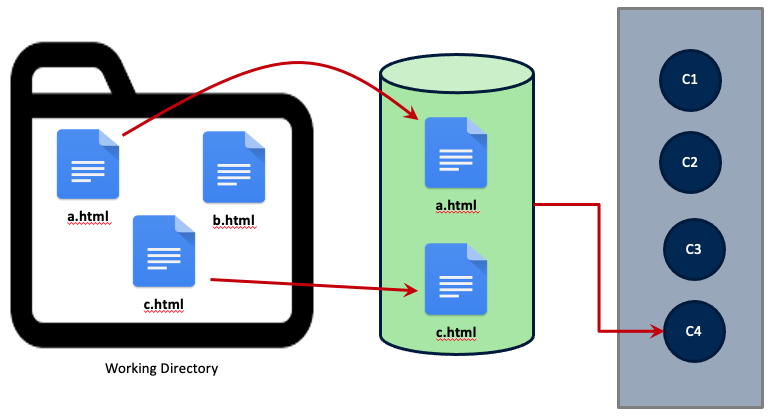

# Creating Your First Repo

Now that we've established how version control works, we can start using it. To
do so, we'll create a new directory under Home and initialize a new Git
*repository* inside it.

## Your First Repo

Using the command line, move to your Home directory

```
$ cd ~
```

**Note:** The `$` character represents your command prompt. You do not need to
type it into your terminal.

Create a new directory for this workshop

```
$ mkdir intro_to_git
```

Change to the new directory

```
$ cd intro_to_git
```

To put this directory under version control, we simply use

```
$ git init
Initialized empty Git repository in /Users/username/intro_to_git/.git/
```

The message your command line sends back indicates what, exactly, putting a
directory under version control means. Notice that Git has created a new,
hidden directory inside `intro_to_git` called `.git`. This is the Git
repository. It doesn't contain any information about your files (yet), but it
does set up all the necessary files and directories that you need to track a
project.

```
$ ls -a .git
HEAD        config      description hooks       info        objects     refs
```

The nice thing about Git is that, for the most part, it automatically
interfaces with the contents of the repository. You can mostly ignore them when
working on a project; they do the important work of keeping track of what
you've committed.

## Checking the Status of a Repo

With our repository made, we can check its status

```
$ git status
On branch master

No commits yet

nothing to commit (create/copy files and use "git add" to track)
```

That makes sense! We haven't done anything yet. We'll discuss some of the
pieces of this message in a bit, but first, let's make a new file.

```
$ echo "Hello world" > hello.txt 
```

Now, we could edit this file, if we like. For example, we could open it with a
text editor (either with Vim or something else), add an exclamation mark at the
end of "world," and save it. Once we do this, the file will read:

```
$ cat hello.txt
Hello world!
```

## Save, Stage, Commit

So far, this should feel very familiar: it's how you probably interact with
your files on a daily basis. But saving a file is not the same thing as
tracking it with a VCS. Git does not automatically preserve **versions** of
every save action.  When working with Git, you can save as you always do, but
this has no impact on the states of this file that are preserved in the
repository. To create a version, you must add saved files to a staging area and
then **commit** those staged files to the repository. The commits you make then
constitute the versions of those files.

As is probably clear, this is a multi-step process: first we save, then we
stage, then we commit.



A more formalized representation of the above diagram is below: you make
changes in your working area, then you stage them, and finally you commit them.


### Step 1: Save the file

So far, we've done the first part of this process: we saved our file.

### Step 2: Stage the file

With the file saved, Git can start tracking it. In fact, Git is already aware
that there's a new file in our directory. We can see this if we run another
status check

<pre style="font-size: small;">
$ git status
On branch master

No commits yet

Untracked files:
  (use "git add <file>..." to include in what will be committed)
	<span style="color:red;">hello.txt</span>

nothing added to commit but untracked files present (use "git add" to track)
</pre>

Notice that Git is pretty verbose. Here, it's telling us that there is an
**untracked** file in the directory. And that makes sense: we've made and saved
`hello.txt` but haven't let Git know that it needs to track this file. This
will involve adding the file to Git's **staging area**.

To do so, we do exactly what the status message above tells us to do

```
$ git add hello.txt
```

When we do another status check

```
$ git status
On branch master

No commits yet

Changes to be committed:
  (use "git rm --cached <file>..." to unstage)
	new file:   hello.txt
```

...Git tells us that `hello.txt` is staged. Even now, however, we haven't made
a version of this file. To do so, we need run a commit command. This will
create a new version of every file in the staging area (in this case, just
`hello.txt`).

### Step 3: Commit the file

Typically, we commit our files in one of two ways. The first is just to run

```
$ git commit
```

If you run this, you might be surprised at what happens next. Git dumps you
into a command line text editor and asks you to write a message explaining what
changes you've made to your files. Every commit has a message (or should have
one) associated with it, as this helps you track what makes one version
different from another.

Here's the message you'll get if you run the above:

```

# Please enter the commit message for your changes. Lines starting
# with '#' will be ignored, and an empty message aborts the commit.
#
# On branch master
#
# Initial commit
#
# Changes to be committed:
#   new file:   hello.txt
#
```

All you'd need to do is write your message on the first empty line and save and
quit. This would be the end of the commit.

But there's some shorthand for this, which is the second way to do a commit.
You'll probably find yourself using it more.

```
$ git commit -m 'Adding my first file to the repository'
```

Using the `-m` flag injects your message directly into the commit, without the
need for a text editor (don't include un-escaped apostrophes your message, as
this will throw off the message!). This is great for short commits, but if you
need to write a longer message about what you've changed, use the other method.

Whichever method you use, once you commit your file, you should see something 
like the following:

```
$ git commit -m 'Adding my first file to the repository'
[master (root-commit) be5fd7e] Adding my first file to the repository
 1 file changed, 1 insertion(+)
 create mode 100644 hello.txt
```

Again, Git is verbose: it shows the message, returns the number of files
changed in the commit, and tracks what/how many changes were made (here,
"insertion").

Running a status check one last time now shows

```
$ git status
On branch master
nothing to commit, working tree clean
```

You're ready to keep working on other parts of the file or project. Before we
move on, let's review some terms for how files flow between states in a Git
repository.


Files begin as untracked. The command `git add` adds the file to the staged
area, and `git commit` adds the new file to the historical record of your
directory. Git takes note of tracked files as you change them. When you do, you
can stage those changes and commit them, thus adding them to the historical
record of the repository. Finally, you can remove a file with `git remove`,
which will tell git to stop tracking future changes to a file.

::: {.exercise #ex1 name="Change a file and commit"}
Now that you've committed a new file to the repository, let's try an exercise. 
See if you can change the file `hello.txt` and commit the changes. 
:::


## View a History of Your Commits

If you'd like to see a history of all the commits in a repository, use

```
$ git log
commit be5fd7eca84a745569b7dbc7ce03ae8517ace7c6 (HEAD -> master)
Author: YOUR NAME <YOU@EMAIL.COM>
Date:  DATE OF THE COMMIT

    Adding my first file to the repository
```

If you want to see the specific changes made in the last commit, use

```
$ git log -p -1
commit be5fd7eca84a745569b7dbc7ce03ae8517ace7c6 (HEAD -> master)
Author: YOUR NAME <YOU@EMAIL.COM>
Date:  DATE OF THE COMMIT

    Adding my first file to the repository

diff --git a/hello.txt b/hello.txt
new file mode 100644
index 0000000..cd08755
--- /dev/null
+++ b/hello.txt
@@ -0,0 +1 @@
+Hello world!
```

This reflects the information we saw when we first committed the file. There's
also a way to see this in a more abbreviated fashion:

```
$ git log --stat
commit be5fd7eca84a745569b7dbc7ce03ae8517ace7c6 (HEAD -> master)
Author: YOUR NAME <YOU@EMAIL.COM>
Date:  DATE OF THE COMMIT

    Adding my first file to the repository

 hello.txt | 1 +
 1 file changed, 1 insertion(+)
```

## Comparing Commits

Let's make a change to our file and re-commit it. We'll open the file and, on a
new line, add the following: "This is my first Git repo."

The contents of the file now look like:

```
Hello world!
 
This is my first Git repo.
```

Save the file, stage it, and commit it with the message "Explaining why I made
this file."

```
$ git commit -m 'Explaining why I made this file"
```

One thing we haven't talked about yet is the long string of alphanumeric
characters in a commit message:

```
commit 259143503862af800a2946381bad30774291f8d9
```

This string is the unique identifier, or **hash**, for a commit. You can use it
to compare one commit against another. But this hash rather long, so it's a bit
more manageable to get its shortened version with:

```
$ git log --oneline
2591435 (HEAD -> master) Explaining why I made this file
be5fd7e Adding my first file to the repository
```

Now, simply copy/paste these two hashes with

```
$ git diff be5fd7e 2591435
diff --git a/hello.txt b/hello.txt
index cd08755..6c32fd5 100644
--- a/hello.txt
+++ b/hello.txt
@@ -1 +1,3 @@
 Hello world!
+
+This is my first Git repo.
```

See the insertions?

## Comparing Files

Running `git diff` on the entire repository will return changes for all files
in that commit. If you wanted to look at a commit for a single file, use

```
$ git diff be5fd7e hello.txt
```

or 

```
$ git diff be5fd7e:hello.txt 2591435:hello.txt
```

Because we only have one file in our directory, the output of either of these
commands will be the same as above.

::: {.exercise #ex2 name="Navigate between commits"}
Check out a previous commit, look at the `git` log and status, then check out
the latest commit and look at log and status.
:::

