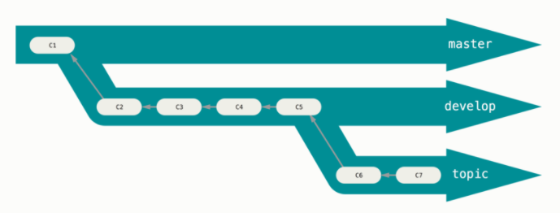

# Git Branching

One of the most powerful parts of Git is its ability to create multiple, 
side-by-side versions of the files in a repository. We call these **branches**. 
Conceptually, branching a repository creates a copy of the codebase in its 
current state, which you can work on without affecting the primary version from 
which it was copied. This allows you (or a team) to work down multiple paths 
without affecting the main (or another person's) codebase.



Why branch?

Well, imagine you have a website, which you track with Git. You've published this 
website, but you're now receiving feature requests from users. While you'd like 
to implement these features, you want to work on them separately before deploying 
them to your website. Here, you'd branch your site, develop your features, and, 
when you're ready, **merge** that branch back into the main site codebase. 
Voilà! Website 2.0 is launched!

## Making a Branch

To see a list of branches in your repository, run

```
$ git branch
* master
```

The asterisk tells you which branch you're on. To create a new branch and switch 
to it, use

```
$ git checkout -b second_branch
Switched to a new branch 'second_branch'
```

Now,

```
$ git branch
  master
* second_branch
```

...has the two branches.

## Making Changes to a Branch

Let's add a second file to our branch

```
$ git checkout second_branch
Switched to branch 'second_branch'
$ echo "This is a second file" > new.txt
```

Stage and commit it

```
$ git add new.txt
$ git commit -m 'Adding a second file'
[second_branch a41096f] Adding a second file
 1 file changed, 1 insertion(+)
 create mode 100644 new.txt
```

See the two files?

```
$ ls
hello.txt new.txt
```

## Checking Out Branches

With our second branch made,we can switch back to, or **checkout**, the first one

```
$ git checkout master
Switched to branch 'master'
```

But look, `new.txt` isn't there:

```
$ ls
hello.txt
```

This is because one branch has different information on it than the other. If 
you want to bring `new.txt` over to the first branch, you'll need to **merge** 
your two branches.

**Note:** Be sure to commit any changes you make on a branch before checking 
another one out. If you don't, those changes will follow you to the new branch, 
and it can be a mess to sort out. If you're not quite ready to commit changes but 
need to switch branches, you can use `git stash` to temporarily store them and 
safely switch branches. Once you're back on the branch with the un-committed 
changes, you can use `git stash apply` to retrieve them from the stash.

## Merging Branches

When you merge a branch, Git folds any changes that you made to files in an 
identified branch into the current working branch. It also adds any new files. 
When you perform a merge, a new commit will be automatically created to track the 
merge. To merge branches, commit any changes to the branch you want to merge 
(which we've already done), then _checkout the branch into which you want to _
_merge_ (here, `master`). Then, execute a merge command.

The whole sequence looks like this:

```
$ git checkout master
$ git merge second_branch
Updating 2591435..a41096f
Fast-forward
 new.txt | 1 +
 1 file changed, 1 insertion(+)
 create mode 100644 new.txt
```

The "fast-forward" here means that we've been able to merge our branches without 
any conflicts (more on unsuccessful merges in a minute). Now, 

```
$ ls
hello.txt new.txt
```

...shows both files.

Note too that the log on `master` has been updated:

```
$ git log --oneline
a41096f (HEAD -> master, second_branch) Adding a second file
2591435 Explaining why I made this file
be5fd7e Adding my first file to the repository
```

::: {.exercise #ex3 name="Comparing branches"}
Inspect the differences between the file `hello.txt` on your two branches. (hint: `git diff`).
:::

## To View an Earlier Commit

The logic of `git checkout` also applies to looking at older commits on a single 
branch. If you wanted to go back to the very first commit on `master`, you could 
use 

```
$ git checkout be5fd7e
```

You'll likely get a long message from Git:

> You are in 'detached HEAD' state. You can look around, make experimental
> changes and commit them, and you can discard any commits you make in this
> state without impacting any branches by switching back to a branch.

The `HEAD` of your repository is the most recent commit on the branch. As the 
message above indicates, any changes you make in this _detached_ state will not 
directly affect other commits. If you're just looking around and don't want to 
make any changes, you can reset to the `HEAD` with

```
$ git checkout master
```

...which will bring you back to the most recent commit. 

But say, for example, you preserve some of the information in that earlier commit. 
You can do so by putting it on a new branch:

```
$ git checkout -b first_commit
$ git branch
* first_commit
  master
  second_branch
```

If you look inside:

```
$ ls
hello.txt
```

...there's a single file, the contents of which:

```
$ cat hello.txt
Hello world!
```

...pertain only to that very first commit we made.

## Fixing Merge Conflicts

Let's open `hello.txt` and, on a new line, add the following: "This is an old 
version of this file." The whole file should look like

```
Hello world!

This is an old version of this file.
```

Save it, stage it, and commit with a message.

```
$ git add hello.txt
$ git commit -m 'Explaining which version this is.'
```

All's well so far. But say you want to merge this file into `master`. Remember 
that, on `master`, this file reads:

```
Hello world!

This is my first Git repo.
```

There are two different versions of this file, so if you run a merge from 
`first_commit` to `master`...

```
$ git checkout master
$ git merge first_commit
Auto-merging hello.txt
CONFLICT (content): Merge conflict in hello.txt
Automatic merge failed; fix conflicts and then commit the result.
```

...you'll get a **merge conflict**. This means that Git is unable to merge the 
two branches because they have different data in the same area of the file (Git 
is usually quite good at merging file versions when their differences are in 
separate areas). We need to resolve these differences manually before Git can 
merge.

To do so, open `hello.txt`. When you do, you'll see this:

```
Hello world!

<<<<<<< HEAD
This is my first Git repo.
=======
This is an old version of this file.
>>>>>>> first_commit
```

Git has injected new text into this file, showing you where exactly the conflict 
lies. It also marks which branch has what information (`HEAD` for `master` and 
`first_commit` for `first_commit`).

Fixing the merge conflict involves deleting the entire section marked off by 
`<<<<<<<` and `>>>>>>>` and replacing it with the information you'd like the 
final, merged file to retain. For us, we'll use the `HEAD` information. 

Once you've made those changes, your file should look like this:

```
Hello world!

This is my first Git repo.
```

Save the changes and run a status check. It should show

<pre style="font-size: small;">
$ git status
On branch master
You have unmerged paths.
  (fix conflicts and run "git commit")
  (use "git merge --abort" to abort the merge)

Unmerged paths:
  (use "git add <file>..." to mark resolution)
	<span style="color: red;">both modified:   hello.txt</span>

no changes added to commit (use "git add" and/or "git commit -a")
</pre>

If you add `hello.txt` and check the repository status again

```
$ git add hello.txt
$ git status
On branch master
All conflicts fixed but you are still merging.
  (use "git commit" to conclude merge)
```

You'll see that your conflicts are resolved. With that done, you can complete the 
merge with a final commit.

```
$ git commit -m 'Fixing conflict between master and first_commit'
[master b3af7fd] Fixing conflict between master and first_commit
```

Looking once more at the contents of `hello.txt` will show which changes you 
implemented

```
Hello world!

This is my first Git repo.
```

And the Git log will have separate entries for the merge conflict and for the 
file from any other branches into which you merged `master`

```
$ git log --oneline
b3af7fd (HEAD -> master) Fixing conflict between master and first_commit
f91603a (first_commit) Explaining which version this is.
a41096f (second_branch) Adding a second file
2591435 Explaining why I made this file
be5fd7e Adding my first file to the repository
```

We can also inspect these changes visually, using `git log --graph`

```
$ git log --all --oneline --graph
*   40a6e83 (HEAD -> master) Fixing conflict between master and first_commit
|\  
| * 9953726 (first_commit) Explaining which version this is.
* | c6113ab (second_branch) Adding a second file
* | 879bfbd Explaining why I made this file
|/  
* a23db84 Adding my first file to the repository
```

You can now keep working!
